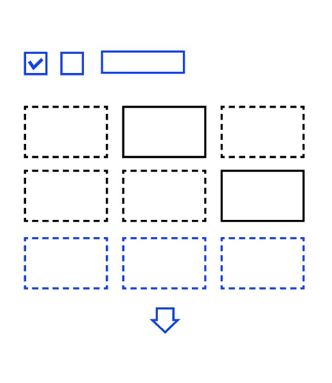

[](https://www.npmjs.com/package/@y7k/component-filterable-list) [](https://www.npmjs.com/package/@y7k/component-filterable-list)

# Y7K Component: Filterable List

This component is a very abstract concept of making a list of _anything_ filterable by _whatever_ and display its items in _whatever way_ you want. While this is a Vue component, you are free to create your list content in any markup you like. The component simply handles the task of initiating loading of more list items. 

It is based on [Vue 2](https://vuejs.org), [MaintainableCSS](https://maintainablecss.com/) and the [Y7K Style Plate](https://github.com/y7k/style). Detailed information in the [Y7K Showroom](https://showroom.y7k.tools/showroom/pages/components/lists/filterable-list/index-filterable-list).




## Installation

##### Install npm package
```bash
npm install @y7k/component-filterable-list --save
```

##### Include in your project
```js
import filterableList from '@y7k/component-filterable-list';
```

##### Variant 1: Register components globally:
```js
import filterableList from '@y7k/component-filterable-list';
filterableList.registerGlobally();
```
 
##### Variant 2: Use components directly:
```js
import { FilterableList } from '@y7k/component-filterable-list';

// Vue component example
export default {

    components: {
        FilterableList,
    },
}
```

##### Include styles
In your main.scss file
```scss
@import '@y7k/filterable-list/src/scss/filterableList';

// You need the styles for these dependencies aswell
@import '@y7k/component-dropdown/src/scss/dropdown';
@import '@y7k/component-checkbox/src/scss/checkbox';
@import '@y7k/component-text-input/src/scss/textInput';
@import '@y7k/component-button-bar/src/scss/buttonBar';
@import '@y7k/component-navigation-bar/src/scss/navigationBar';

// If you don't set "node_modules" as a webpack include path:
@import '../[path]/../node_modules/@y7k/component-filterable-list/src/scss/filterableList';
...
```


## Documentation
Please have a look at the usage documentation in the [Y7K Showroom](https://showroom.y7k.tools/showroom/pages/components/lists/filterable-list/index-filterable-list).
